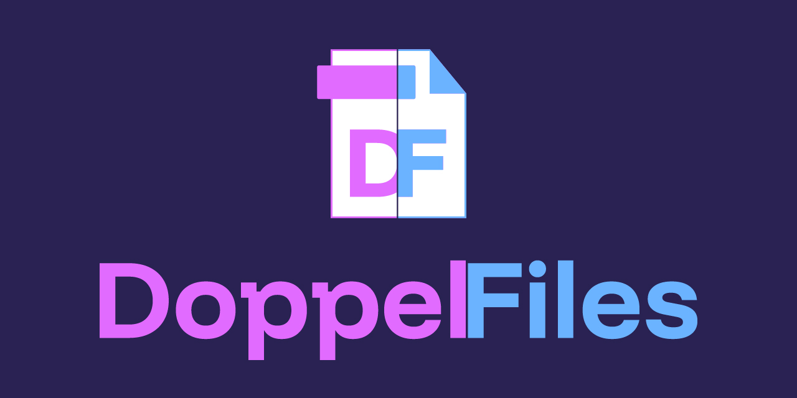

# DoppelFiles
Programa encargado de encontrar duplicados dentro de una o más carpetas designadas, y mover todas las copias a una carpeta destino.
Próximamente mejoras en la usabilidad.

## Índice
1. [Introducción](#introducción) - ([Versionado](#versionado))
2. [Instalación](#instalación)
3. [Uso](#uso)
4. [Estado actual](#estado-actual) - ([Funciones](#funciones), [Problemas y soluciones](#problemas-y-soluciones))
5. [A futuro](#a-futuro)
6. [Contribuciones](#contribuciones)
7. [Licencia](#licencia)

## INTRODUCCIÓN
Trabajo con un enorme volumen de archivos y discos, muchas veces por falta de tiempo he tenido que mover documentos entre discos sin verificar si ya existían.
Esto a largo plazo me dejó con un desorden importante, por eso necesitaba un programa que me permitiera manejar toda esa cantidad y limpiar los duplicados.
Entiendo que existen ya programas para esto sin embargo las mejores opciones son de pago y/o no me generan mucha confianza, en especial aquellas que utilizan llamadas a servidor.
Siendo una razón más para crear mi propio programa.

En mi inocencia creí que iba a ser algo pequeño y simple, al final resultó un quebradero de cabeza con la cantidad de errores que fueron apareciendo. Entonces decidí compartir el progreso,
por si a alguien más le servía de ayuda o inspiración.

### Versionado
Al final vi que no tenía sentido mi idea original así que decidí terminar el programa y tener una versión completa básica para pasar a usar el versionado clásico directamente
~~~
MAYOR.MENOR.PARCHE # Al momento de publicar este cambio sería la v1.0.0
~~~
## INSTALACIÓN
### Requisitos previos
1. Python 3.9 o superior.
2. Dependencias listadas en "requirements.txt"

### Instrucciones
1. Clona este repositorio.
2. cd DoppelFiles
3. pip install -r requirements.txt

## USO
1. Inicia el programa desde la terminal: python main.py
2. Elegí la/s carpeta/s de origen. Si son más de una tenés que separa el path con ","
3. Elegí la carpeta de destino.
4. Definí el tipo de archivo a buscar.
5. Inicia la búsqueda.
Si te saltas algún paso la búsqueda no inicia y aparece un mensaje avisando del paso faltante.

## ESTADO ACTUAL
### Funciones
#### Generales
- Barra de progreso.
- Busca en una o más carpetas definidas. Comparando todos los archivos de todas.
- Mueve las copias a la carpeta destino seleccionada.
- Genera un registro con la operación realizada.
- Utiliza ese registro para permitir deshacer la última operación.
- Genera un registro con todos los errores.
#### Imagenes
- **Extensiones:** ".jpg", ".jpeg", ".png", ".gif", ".bmp", ".tiff", ".webp", ".svg"
- Identifica todas las copias incluso si difieren en dimensiones, peso, compresión o metadatos.
- De todas las copias selecciona y deja la de mejor calidad, mueve las demás.
- Crea una subcarpeta "Problematicos" y mueve todos los archivos que no se pudieron procesar por un error.
- Prevención de errores por imagenes truncadas o abiertas por otros procesos.
#### Videos
- **Extensiones:** ".mp4", ".avi", ".mov", ".mkv", ".flv", ".wmv", ".webm"
- Identifica todas las copias incluso si difieren en dimensiones, peso, compresión o metadatos.
- De todas las copias selecciona y deja la de mejor calidad, mueve las demás.
- Crea una subcarpeta "Problematicos" y mueve todos los archivos que no se pudieron procesar por un error.
- Cuenta con configuraciones dinámicas para el "backend" y el "intervalo de frames".
#### Audio
- **Extensiones:** ".mp3", ".m4a", ".wav", ".flac", ".aac", ".ogg"
- Busca copias exactas de los archivos.
- Discrimina entre extensiones. No va a tomar como duplicados dos archivos iguales pero en diferentes extensiones.
#### Documentos
- **Extensiones:** ".txt", ".doc", ".docx", ".xls", ".xlsx", ".xlsm", ".ppt", ".pptx", ".ppsx", ".odt", ".ods", ".odp", ".pdf", ".epub", ".mobi"
- Busca copias exactas de los archivos.
- Discrimina entre extensiones. No va a tomar como duplicados dos archivos iguales pero en diferentes extensiones.
#### Otros
- **Extensiones:** ".zip", ".rar", ".7z", ".tar", ".gz", ".iso", ".ttf", ".otf"
- Busca copias exactas de los archivos.
- Discrimina entre extensiones. No va a tomar como duplicados dos archivos iguales pero en diferentes extensiones.
#### Código (editando)
- Se puede ajustar la sensibilidad en la identificación de imagenes y videos.
**AVISO:** Disminuir la precisión aumenta la cantidad de copias similares que toma pero también aumentan los falsos positivos.
- - -
### Problemas y soluciones
#### Error con OpenCV y PyLint:
- Mensaje: Module 'cv2' has no ...
- Solución: Agrega el siguiente argumento en la configuración de PyLint. "python.linting.pylintArgs": ["--extension-pkg-whitelist=cv2"]
#### Error al procesar imágenes corruptas:
- Mensaje: cannot identify image file.
- Solución: El programa ignora automáticamente las imágenes no válidas y registra los errores en "log_errores.txt"
#### Error al decodificar H.264
Sigo trabajando para encontrar la solución a este problema. En una de las versiones anteriores no pasaba pero creo que sobreescribí ese archivo por accidente, así que me toca investigar de vuelta.
#### Filtro estricto
No es un problema en sí pero según como se configuré cada módulo puede ser más exigente o más permisivo en cuanto a la similitud de cada archivo. Actualmente está en un punto intermedio donde
en las prubas no arrojó ningún falso positivo pero sí dejó varias copias similares, más no identicas, sin procesar.

## A FUTURO
### Módulos de procesamiento
- Permitir configurar los parametros de análisis y procesamiento previo a ejecutar la búsqueda.
- Procesamiento de miniaturas.
### General
- Añadir módulos para el procesamiento de documentos y varios.
- Permitir la elección de Mover, Eliminar u Omitir.
- Mejorar el registro de errores y operaciones para identificar mejor cada error y falsos positivos.
### Interfaz Gráfica
- Añadir una versión con interfaz gráfica.
- Permitir visualizar previamente los archivos duplicados.
- Permitir seleccionar cada uno y que se debe hacer con ellos.

## CONTRIBUCIONES
Como dije al principio, este proyecto lo pensé originalmente para mi uso personal. Pero si a alguien le sirve y quiere modificarlo a su gusto y necesidad sientase libre de crear un fork de este repositorio.

## LICENCIA
Este proyecto se encuentra bajo la licencia AGPL v3.0.
